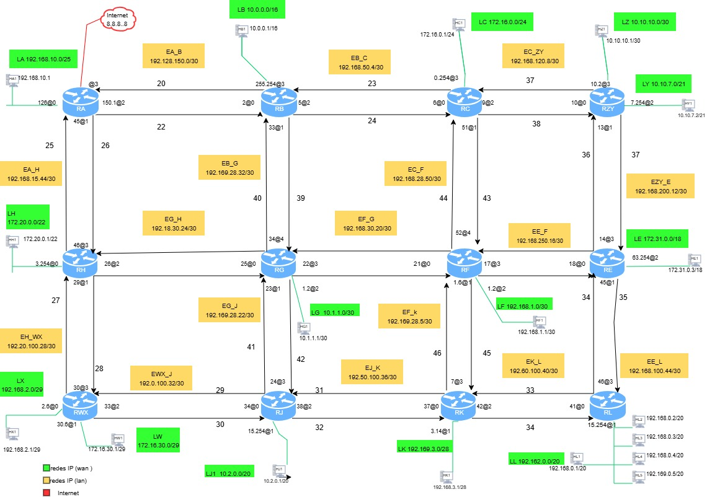

# Proyecto Final Laboratorio Kathará

## tercer commit
 Cambios realizados
 **Implementación de enrutamiento ospf:** : Se configuró OSPF en todos los routers de la topología, respetando áreas, adyacencias y métricas.
 **Configuración de áreas:**  Se establecieron  las áreas OSPF (Área 0, Área 1 y Área 2) entre routers
 **Asignación de costos:** Se crea archivo txt con metricas asignadas.
 **Generación y verificación del arbol spf:** Se calculó el árbol SPF desde el router RA (salida a Internet),
**Propagación de rutas y Pruebas de convergencia :**Se reinician router y modifican costos  para validar reclaculo automáticos.  

`  kathara lstart --noterminals / kathara lrestart --noterminals`

## Carpeta de imágenes
Todas las imágenes del proyecto están en la carpeta `imagenes`.

### Topología de red

