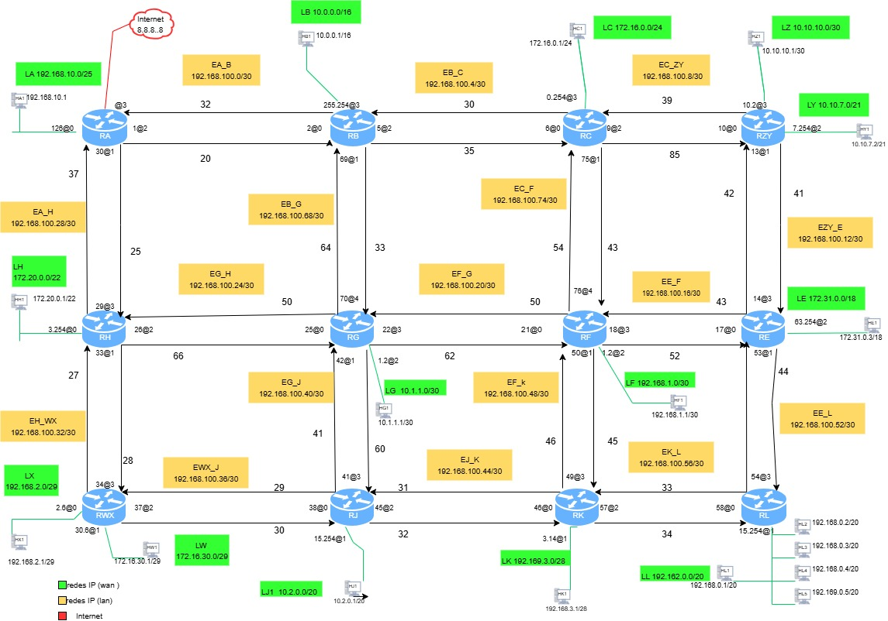

# Proyecto Final Laboratorio Kathará

## Sexto registro – Configuración del Servidor DHCP
 - Cambios realizados
1. Configuración DHCP centralizada
    Se instaló y configuró un servidor DHCP en el router RL (Gateway de la LAN) para asignar direcciones IP automáticas a los hosts de la red interna.
    El servidor DHCP funciona sobre la interfaz eth1, conectada a la LAN.
##
2.  Asignación de direcciones IP estáticas y dinámicas
    Se configuraron dos hosts con IP fija por MAC y el resto con asignación dinámica:

    | Host | Tipo de IP           | Dirección                   |
    | ---- | -------------------- | ----------------------------|
    | HL1  | Estática (reservada) | 192.168.0.1                 |
    | HL2  | Estática (reservada) | 192.168.0.2                 |
    | HL3  | Dinámica             | 192.168.0.3 – 192.168.0.253 |
    | HL4  | Dinámica             | 192.168.0.3 – 192.168.0.253 |
    | HL5  | Dinámica             | 192.168.0.3 – 192.168.0.253 |

##  
3. Lease Time configurado
    El tiempo de concesión DHCP fue configurado en 5 minutos (300 segundos) según la consigna del laboratorio:
    default-lease-time 300;
    max-lease-time 300;

## 
4. Configuración del servidor DHCP
    Archivo: rl/etc/dhcp/dhcpd.conf
    Archivo: rl/etc/default/isc-dhcp-ser
##
5.  verirficación del servicio
    En el router RL: ps aux | grep dhcpd
                     ss -lunp | grep 67
     En los hots hl3,hl4,hl5 hacemos prueba de conectividad 
     ping -c3 192.168.15.254
     ping -c3 8.8.8.8                  
##
6. Reglas del laboratorio
    La configuración respeta la nomenclatura de los routers y hosts según la topología.
    Funciona con scripts de Kathará (lstart y lrestart) sin modificaciones.

## Carpeta de imágenes
Todas las imágenes del proyecto están en la carpeta `imagenes`.

### Topología de red

