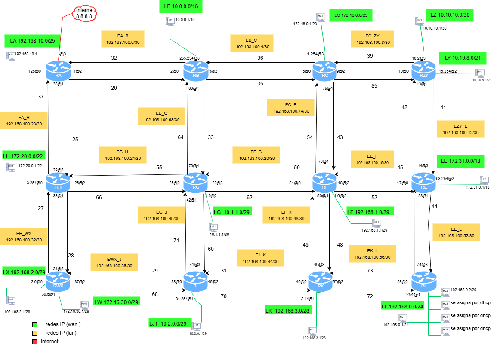
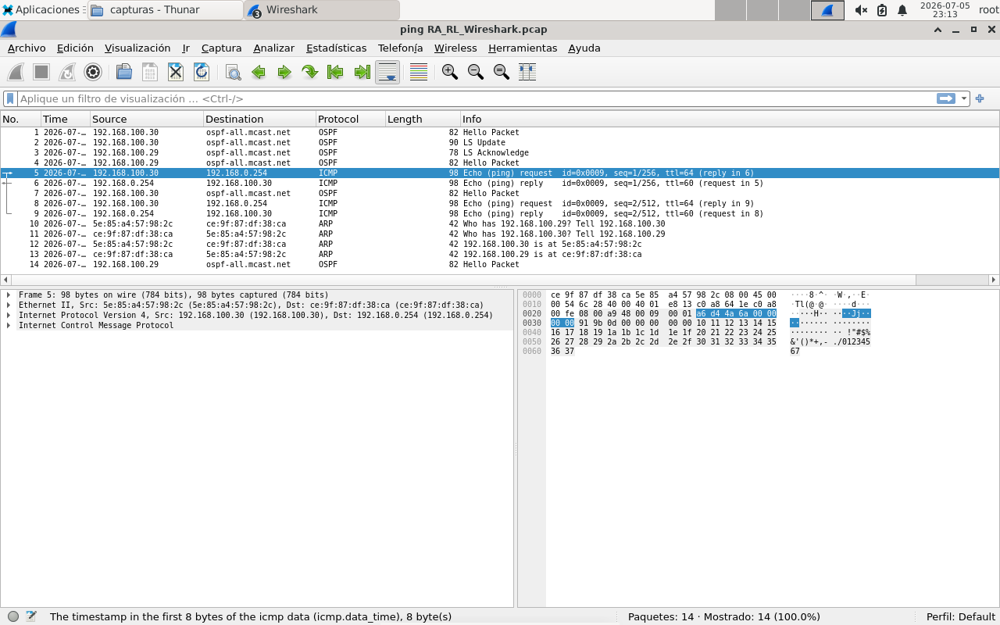

# Proyecto Final - Laboratorio Kathará
## Décimo commit:  Versión 2.0 del laboratorio

En esta versión final del laboratorio se realizó una actualización de la configuración del protocolo OSPF con los siguientes objetivos:

- Reorganización de las áreas OSPF según la topología final.
- Actualización de las métricas de las interfaces para optimizar la selección de rutas.
- Modificación de los archivos `ospfd.conf` de los routers.
- Actualización de la configuración de los routers **RC** y **RF** para garantizar el correcto intercambio de rutas entre las áreas.
- Verificación del funcionamiento mediante pruebas de conectividad y consultas OSPF.
- Validación del enrutamiento mediante una captura de tráfico analizada con Wireshark entre el router **RA** y el gateway de la LAN asociada al router **RL**.

## Carpeta de imágenes

#

# Captura de tráfico (Wireshark)

Durante las pruebas de funcionamiento se realizaron capturas de tráfico entre los routers del laboratorio para verificar el correcto funcionamiento del enrutamiento dinámico y la comunicación entre redes.

En las capturas se analizaron los siguientes protocolos:

- OSPF Hello
- OSPF Link State Update (LS Update)
- OSPF Link State Acknowledge (LS Ack)
- ICMP Echo Request
- ICMP Echo Reply
- ARP Request
- ARP Reply
- IPv4
- Ethernet II

---

# Archivos de captura

Las capturas utilizadas para el análisis se encuentran en:

- `shared/capturas/ping RA_RL_Wireshark.pcap`

Estas capturas permiten comprobar:

- El intercambio de mensajes OSPF entre routers.
- La resolución de direcciones MAC mediante ARP.
- La comunicación mediante ICMP (Ping).
